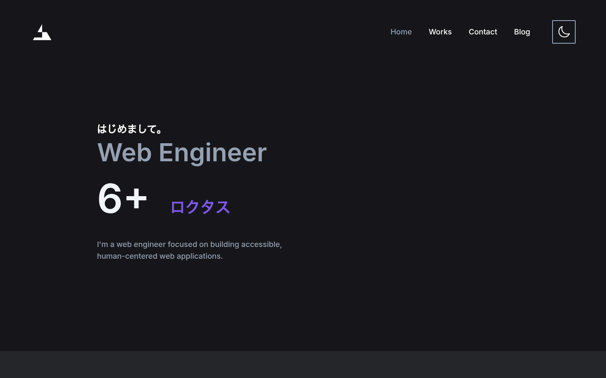

# 6+ Portfolio

Remix + TypeScript 製の個人運営ポートフォリオサイト。Vercel で SSR 運用中。

- **本番URL**: https://6plus.vercel.app （2026-10-04 時点で HTTP 200、SSR で HTML を返却することを実測確認済み / 48 KB）
- **リポジトリ**: https://github.com/6plusjp/www_vercel
- **デプロイ元ブランチ**: `main`（Vercel の既定ブランチ。`dev` の内容は本番に反映されません）

---

## スクリーンショット



---

## 稼働状況

- **本番環境で動作中**（Vercel SSR deployment）
- 2022-04-03 の Initial commit から約 4 年半、継続的に開発・更新中
- ルーティング 17 ファイル（共通レイアウト `_layout.tsx`）、`app/`・`content/`・`styles/` で TS・TSX・CSS・MDX 約 8,300 行

---

## 技術スタック

| 分類       | 技術                                                                     |
| ---------- | ------------------------------------------------------------------------ |
| Framework  | **Remix**（Vite ビルド構成）                                             |
| Language   | **TypeScript**                                                           |
| Styling    | **Tailwind CSS**                                                         |
| Content    | **MDX**（bundler 経由でビルド時に変換）                                  |
| Testing    | **Playwright**（E2E）                                                    |
| Deployment | **Vercel**（SSR / Server deployment）                                    |
| Env        | **Vercel** のプロジェクト設定で管理（アプリ側は `process.env` のみ参照） |

---

## 主な機能・ルーティング（実在する 17 ルート）

| Route                                                               | 概要                                           |
| ------------------------------------------------------------------- | ---------------------------------------------- |
| `_index.tsx`                                                        | トップページ                                   |
| `_layout.tsx`                                                       | 共通レイアウト（ルートを持たない親レイアウト） |
| `blog._index.tsx` / `blog.$slug.tsx`                                | ブログ一覧・詳細                               |
| `blog.rss[.]xml.tsx`                                                | RSS フィード生成                               |
| `works._index.tsx` / `works.$slug.tsx`                              | 実績一覧・詳細                                 |
| `_resume.tsx` / `_resume.resume.$lang.tsx` / `resume.$lang.pdf.tsx` | 履歴書（日本語・英語の切替・PDF 生成）         |
| `contact._index.tsx`                                                | 問い合わせフォーム（ハニーポット）             |
| `_layout.policy._index.tsx` / `_layout.terms._index.tsx`            | プライバシーポリシー・利用規約                 |
| `_md.tsx` / `_md.uses.mdx`                                          | MDX レンダリング共通コンポーネント             |
| `action.form-validation.tsx` / `action.set-theme.ts`                | Action（フォーム検証・テーマ切替）             |

### コンテンツ管理

- `content/blog/*.mdx`、`content/works/*.mdx` をファイルベースで管理
- MDX はビルド時に変換、ランタイム依存を持たない

---

## 実装上の工夫

### スパム対策

- **ハニーポット**: `app/utils/honeypot.server.ts`

### セッション管理

- `app/utils/session.server.ts` でサーバーサイドセッションを実装

### SEO ユーティリティ

- `app/utils/seo.ts` にて OG 画像・Twitter カード・canonical URL を一元管理

### メール送信（現在は無効化）

- `app/utils/email.server.ts` に MailerSend API を使ったサーバーサイド送信処理を実装済み（コードは現在もリポジトリに残置）
- Vercel のフリードメイン（`*.vercel.app`）へ移行し送信元ドメインの検証ができなくなったため、送信機能のみ無効化しています（問い合わせは直接メールでお願いします）。

### sitemap / robots.txt

- カスタム `app/entry.server.tsx` で `/sitemap.xml` と `/robots.txt` を配信
- サイトマップ生成・robots テキストは `app/utils/seo.ts` に集約
- クローラ制御: `/admin/`・`/action/`・`/resume/` へのクロールを拒否し、GPTBot にも個別に disallow を指定

### 入力バリデーション

- `action.form-validation.tsx` でフォーム入力を検証し、サーバーアクション側で再検証
- **Zod** スキーマ + `withZod` によるスキーマベースの検証を実装
- `app/utils/assertion.ts` に型アサーションを集約

### アクセシビリティ

- スキップナビゲーション（`SkipContent`）・各アイコンの `aria-label`・focus-visible によるキーボード操作対応
- `prefers-reduced-motion`（`useReducedMotion`）を尊重したアニメーション制御

### エラーハンドリング

- `app/root.tsx` の `ErrorBoundary` で 404 / 一般エラー / 不明エラーの 3 状態を共通レイアウトで処理
- 開発時はスタックトレースを表示し、本番でも導線（ナビゲーション）を維持

### パフォーマンス

- sitemap / robots に `Cache-Control: public, max-age=3600`、ブログ・実績のレスポンスに `private, max-age=3600` を付与
- リンクの `prefetch="intent"`、Cloudinary のレスポンシブ画像（`srcSet` / `sizes`）、スケルトンローディング

### プログレッシブエンハンスメント

- JavaScript 無効環境でも送信できる問い合わせフォーム（`NoJsFormRoute`）

### UI モーション

- **framer-motion** による一覧カードのマウント・ホバーアニメーション

### PWA・アクセス解析

- `site.webmanifest`・apple-touch-icon による PWA 対応
- **Vercel Analytics** によるアクセス計測

---

## 開発・運用の仕組み

- **Deployment**: Vercel（SSR / Server deployment）へ push するだけで自動デプロイ
- **環境変数**: Vercel のプロジェクト設定で管理し、`process.env` 経由で参照する（ローカルは `.env.example` を参考に手動で用意）
- **テスト**: Playwright による E2E テスト（`tests/contact.spec.ts`、`tests/portfolio.spec.ts`、`tests/spec.spec.ts`、セットアップ用 `tests/global-setup.ts`）を `npm test` でローカル実行
- **CI**: GitHub Actions（`.github/workflows/ci.yml`）で typecheck・lint・E2E を pull request / push ごとに実行
- **ビルド**: `vite build` → Remix Vite plugin による SSR バンドル生成

---

## 技術的課題の解決履歴（代表的なもの）

開発途中で直面した Vercel 環境・ESM/CJS 互換・ビルド周りの課題を、コミット単位で解決してきた履歴があります。

- **Remix を Vite ビルドに移行**（Vercel 出力要件への対応）
- **`ssr.noExternal` 設定**で CommonJS モジュールをバンドルに含めるよう調整
- **nanoid を 3.1.31 にダウングレード**（CJS 互換性確保のため）
- **`require` を `env.server.ts` から除去**（ESM 互換化）
- **`fs.server.ts` で `process.cwd()` を使用**（Vercel 上でのファイルシステムアクセス安定化）
- **esbuild ターゲットに es2022 を追加**（分割代入等のモダン構文対応）

---

## ディレクトリ構成（抜粋）

```
app/
├── routes/              # 17 ファイル（ファイルベースルーティング）
├── utils/               # honeypot, session, seo, email 等
├── components/          # 共通 UI コンポーネント
├── entry.client.tsx
├── entry.server.tsx     # SSR エントリポイント（sitemap.xml / robots.txt もここで処理）
└── root.tsx
content/
├── blog/                # *.mdx
└── works/               # *.mdx
styles/                  # PostCSS ソース（tailwind / prose / font / no-script）
.github/
└── workflows/           # CI（typecheck / lint / E2E）
docs/
└── assets/              # README 用スクリーンショット
tests/                   # Playwright E2E
```

---

## 開発コマンド

```bash
# 依存インストール
npm install

# 開発サーバー（Vite + Remix）
npm run dev

# ビルド（本番用）
npm run build

# 型チェック
npm run typecheck

# Lint
npm run lint

# E2E テスト（Playwright）
npm test

# README 用スクリーンショットを再生成
# （別ターミナルで npm run dev を起動しておく）
npm run screenshot

# ビルドキャッシュ・生成物の削除
npm run cleanup
```

---

## ライセンス

MIT License — 詳細は [LICENSE](LICENSE) を参照してください。

コードの再利用・参考は自由ですが、コンテンツの無断転載はご遠慮ください。
